# ZhongYuToolBox · Windows / Android / iOS aoki edition

基于 [Loshop-Studio/ZhongYuToolBox_Web](https://github.com/Loshop-Studio/ZhongYuToolBox_Web) 的独立 Windows / Android / iOS 改造版。原作者 **Loshop**；新增 co-author **aoki**。感谢原作者及所有贡献者，保留原有“支持作者”入口与捐赠对象。本 fork 不代表中育官方或原作者发布。

## 下载与安装

[最新正式版与全部下载文件](https://github.com/nickfox395/ZhongYuToolBox_Web/releases/latest) · [开发中的三端源码](https://github.com/nickfox395/ZhongYuToolBox_Web/tree/feature/ios-liquid-glass-1.1.9) · [原作者项目](https://github.com/Loshop-Studio/ZhongYuToolBox_Web)

当前正式版为 **1.1.13-aoki**，三端版本号统一。新增随身答 SVG / MP4 导出、关于应用和检查更新，并修复移动画板布局、文字与颜色撤销/重做。Windows 提供安装程序和便携包，Android 提供 APK，iPhone / iPad 提供未签名 IPA。

| 平台 | 下载文件 | 安装方式 |
| --- | --- | --- |
| Windows 10/11 x64 | `Windows-x64-Setup.exe` 或便携 ZIP | 运行安装程序；便携版完整解压后打开 exe，需要系统 WebView2 Runtime |
| Android 8.0+ | `Android.apk` | 在 Android 设备打开 APK，按系统提示安装，需要较新的系统 WebView |
| iPhone / iPad · iOS 16+ | `iOS-unsigned.ipa` | 未签名包需自行签名（如爱思助手）后安装，并在设备设置中完成信任；iOS 26 使用系统 Liquid Glass 导航 |

安装包不包含账号、密码、Token 或个人笔记。Windows 同一系统用户的不同便携版本复用 `%LOCALAPPDATA%\ZhongYuToolbox-aoki-WebView2` 的既有登录缓存；自动登录不等于账号被打进安装包。

## 实际运行界面

以下是实际应用和测试环境截图，不是设计稿。iPhone / iPad 的 1.1.13 截图来自 iOS 26 模拟器中运行的 UIKit + WKWebView 应用；Android 截图来自 1.1.12 模拟器，导航布局沿用至当前版本。Windows 的 1.1.13 网页资源以 WebView2 模式运行，列表使用离线演示数据。专栏和画板测试使用合成资料，截图未展示真实账号和学习资料。

<p>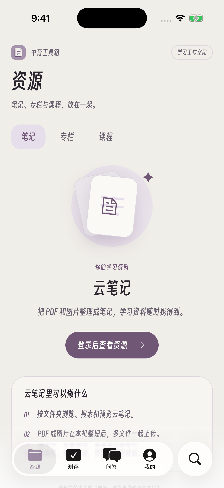 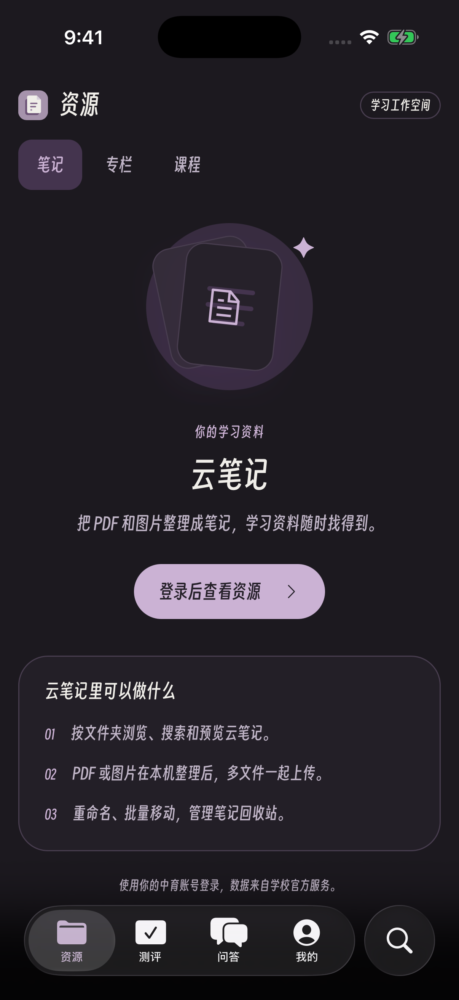 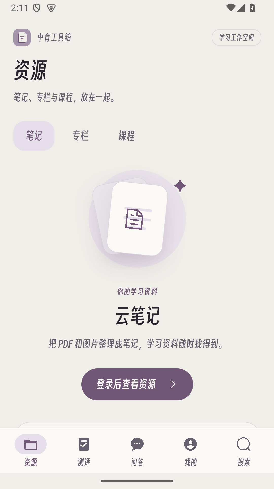</p>

**iPhone 画板回复**：实际输入文字、撤销并重做后的画布，缩放为正数。

<p>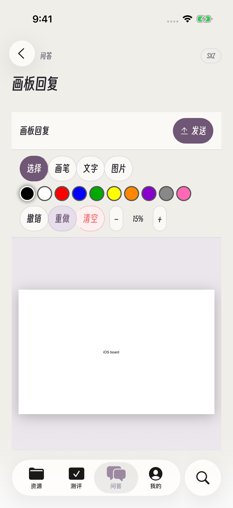</p>

**iPad 竖屏**：完整资源页及 Apple 原生底栏。

<p>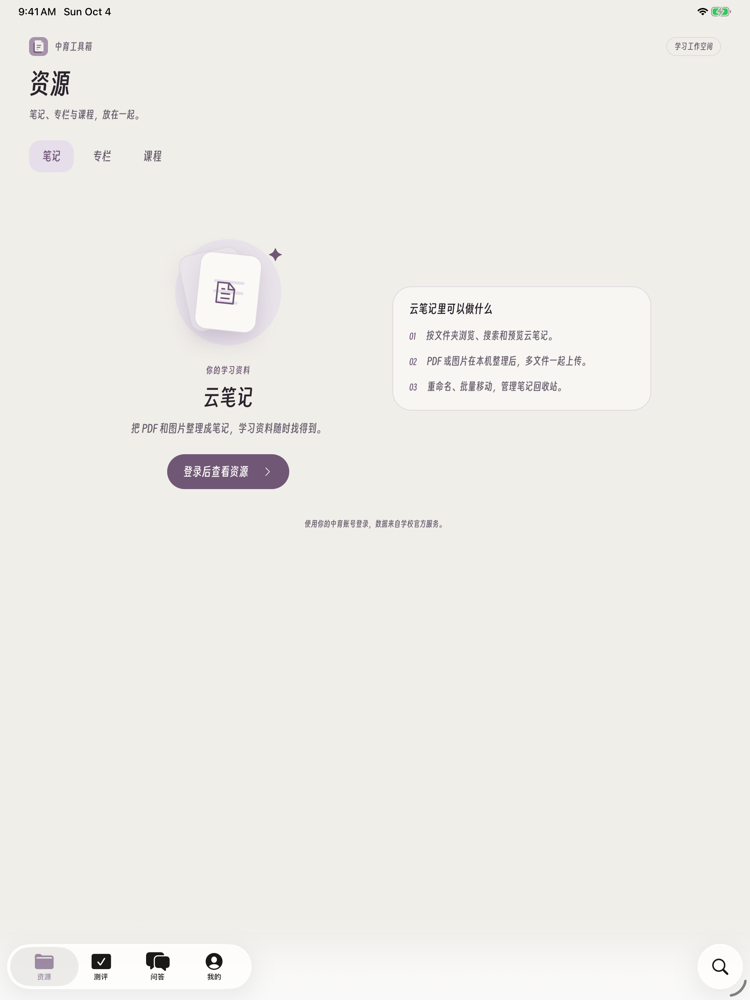</p>

**iPad 横屏**：截取整个模拟器屏幕，分别核查专栏列表、文章图片和“我的”页面；内容可正常滚动，四个原生标签在屏幕底部。浅色和深色截图独立标注，避免将 Windows 界面误认为 iPad。

<p>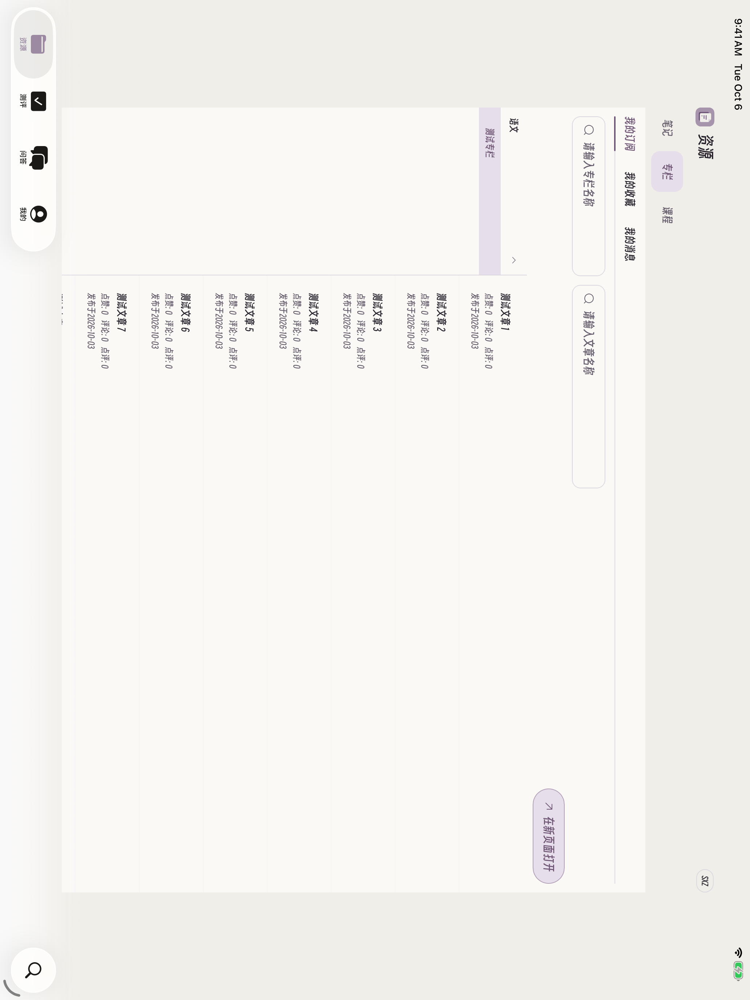</p>

<p>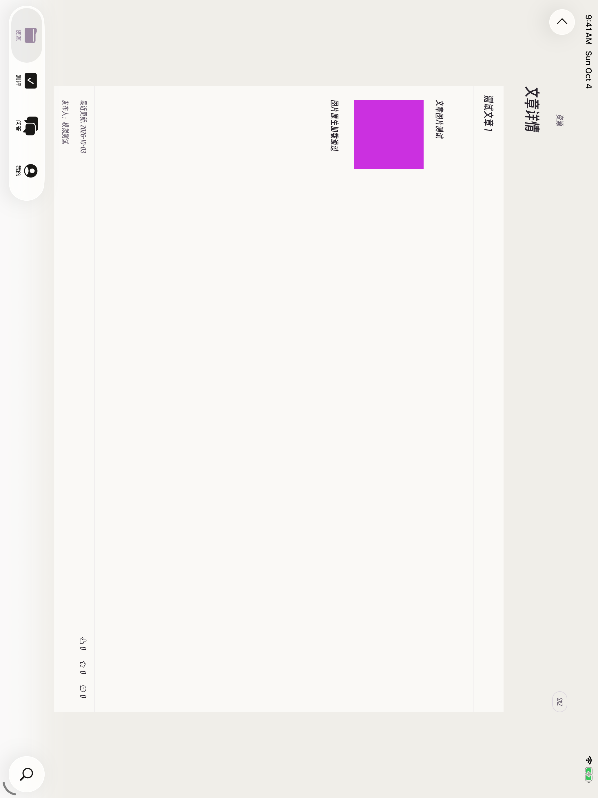</p>

<p>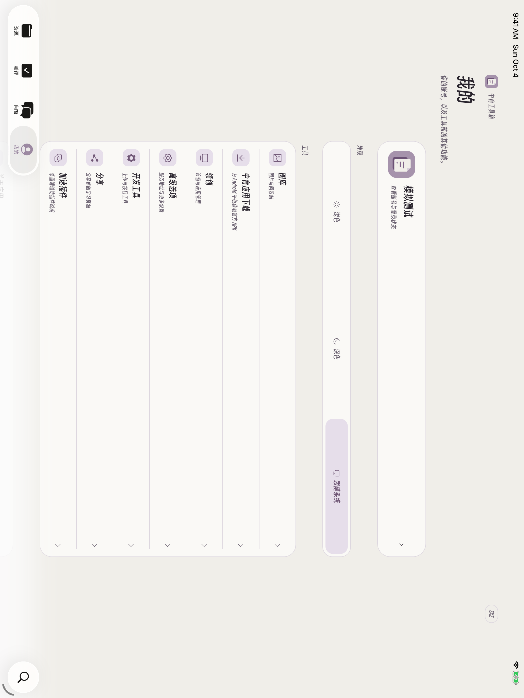</p>

<p>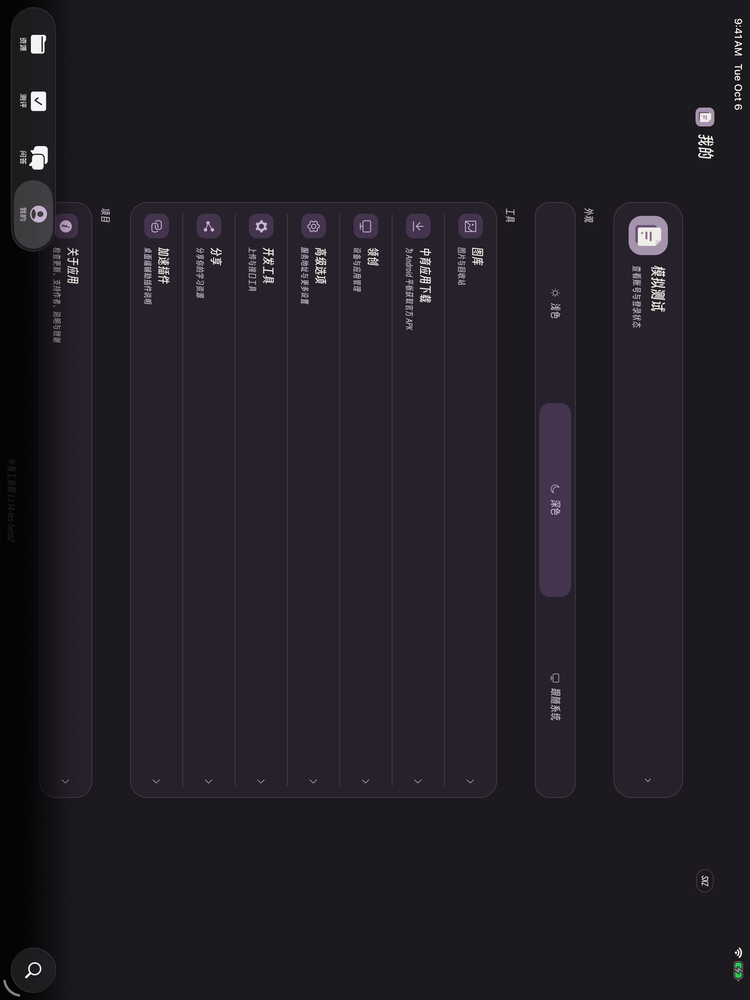</p>

**Windows**：云笔记与关于应用，重新拍摄完整视口；检查更新截图显示已发布的 1.1.13-aoki 正式版。

<p>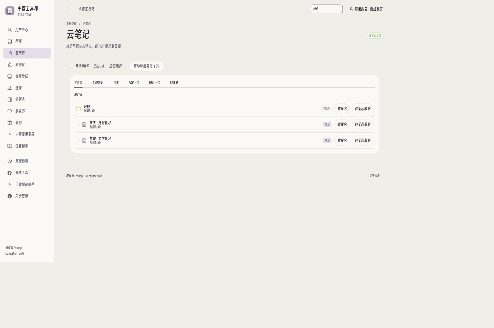</p>

<p>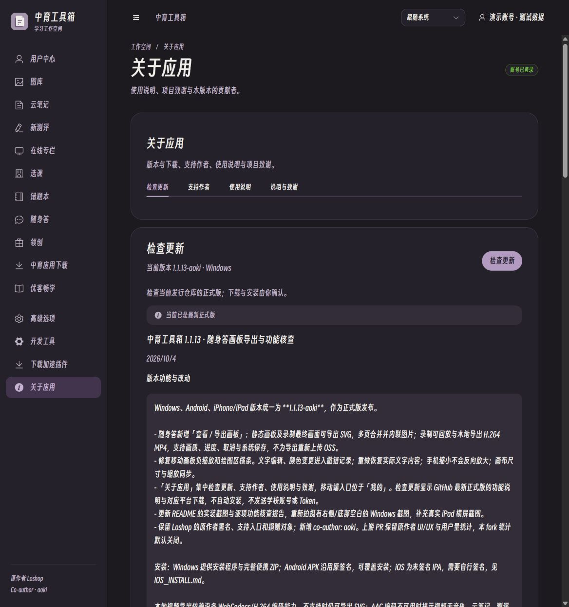</p>

## 移动端导航

底部统一四组：**资源、测评、问答、我的**。资源包含笔记、专栏、课程及选课；测评包含作业与官方错题本；问答进入随身答；我的集中账号、外观、图库、应用下载、其他工具和关于应用。

iPhone / iPad 使用 **Swift + UIKit + WKWebView**。业务前端从包内资源加载，iOS/iPadOS 26 的底栏、搜索与返回控制使用 Apple 原生组件；较旧系统使用兼容导航。Android 使用原生 Android WebView，沿用同一分组 UX，使用普通移动底栏。APK 下载仅用于 Android，不能在 iOS 安装。

`npm run test:ios` 验证桥接与 OSS；`npm run build:ios` 在 macOS / Xcode 26+ 生成未签名 IPA；Windows 可运行 `npm run build:ios -- --web-only` 检查前端。云端构建见 **Build iOS IPA**。完整构建与签名步骤见 [iOS 说明](https://github.com/nickfox395/ZhongYuToolBox_Web/blob/feature/ios-liquid-glass-1.1.9/native-ios/README.md)。

## 1.1.13 新增：随身答画板与关于应用

- 在随身答回复下打开「查看 / 导出画板」。静态画板可在本地导出 SVG，多页纵向合并且图片内联；录制可回放，并选择 960p / 1280p / 1920p 长边导出 MP4。录制也可导出最终画面 SVG。
- 沿用原作者最新 `ezy-board-viewer` 源码，MP4 使用 WebCodecs / H.264，本地处理后进入系统保存流程，不为了导出重新上传 OSS。没有视频编码能力时仍可导出 SVG；没有 AAC 编码能力时会提示视频无音轨。实际音画同步仍取决于原始录制时间轴。
- 导出可取消，离开页面会停止下载与编码；多页不同尺寸会居中留白，编码器在成功、失败和取消后释放。
- 修复 iOS 画板回复出现负缩放值、绘图区只剩横条：有效容器尺寸才参与缩放，画布尺寸同步更新，并提供移动触摸绘图区域；文字编辑与颜色变化进入撤销历史，重做恢复实际内容。
- 桌面「关于应用」合并检查更新、支持作者、使用说明、功能说明与致谢；移动端在「我的 → 关于应用」。保留 Loshop 的支持入口与原有捐赠对象。
- 手动查询本 fork 的 GitHub 最新正式版，显示版本功能说明和对应平台下载文件，跳转 GitHub 完成下载。上游版本查询上游仓库。不会自动下载安装，也不会把学校账号或 Token 发给 GitHub。

## Windows 版本

- 支持导入用户提供的最新 APK / ZIP，按摘要识别 7 个应用，分别展示在线与本地版本，并离线另存为。图库集成在中育桌面。使用方式见 [OFFICIAL_APPS.md](https://github.com/nickfox395/ZhongYuToolBox_Web/blob/feature/ios-liquid-glass-1.1.9/OFFICIAL_APPS.md)。
- 图库支持选中移至官方回收站、恢复及永久删除；请求合约来自中育桌面 APK，删除前确认并重新核对图片状态。
- 新增「中育应用下载」：从当前学校官方 `AppStore/CheckUpdateAsync` 更新接口查询优课畅学等常用学生应用（`appType=0`），无需领创绑定。支持名称筛选、完整包名查询、进度与取消、文件大小 / APK 结构检查及 SHA-256 摘要。APK 从官方地址下载到本机，安装与课程权限由平板和学校控制。此列表不是官方商店的完整目录；摘要用于传输校验，不代替官方签名验证。

- WPF 原生窗口 + 系统 WebView2，发布包不包含 Electron / Node。
- 得意黑字体，灰紫／暖白配色，浅色／深色／跟随系统模式；收起侧栏图标居中；侧栏与页面增加过渡，尊重减少动态效果设置。
- PNG、JPG、WebP 在本地合成 PDF，可重排图片和逐张逆时针旋转；竖版 PDF 自动逆时针 90°，整页保留，不裁切原文件。
- 云笔记重命名、移至官方回收站、查看回收站、单条 / 多选永久删除和批量移动文件夹；移动保留最新名称与版本，逐条反馈结果。
- 一次多选 PDF，每个文件独立命名并按队列上传；失败可单独重试，成功文件不重复提交；新一轮选择自动更新默认名称。
- 新的紫色笔记图标，SVG 源文件及生成 Windows 多尺寸图标的脚本随源码提供。
- 新测评默认打开已完成作业；当前页自动读取题目分析并按学生 ID 识别本人错题，直接在列表显示加入官方错题本按钮；翻页自动继续，读取失败可刷新重试。写入前重新核对官方状态去重。没有独立的本地错题本界面。
- 测评详情只在当前页面加载，离开时取消请求，拒绝无效编号并忽略迟到响应，修复返回列表后的 `id=NaN` 错误。
- 官方错题本可导出选中题目或本科全部题目为 A4 PDF。全部题目连续编号在前，答案与解析另起一页，编号对应；思源宋体约 12 磅，紧凑排版，长题利用剩余空间自动续页。LaTeX 公式用随包 KaTeX 在本地排版，主字号与正文一致，上下标保留数学比例；公式图片带有 LaTeX 源码时重新排版，其他图片保留题目声明的像素或 em 显示尺寸。
- 官方错题本支持单题删除与多选删除，确认后按实际条目 ID 提交，服务端拒绝时保留界面题目。
- 选课嵌入预加载官方加密学生资料，修复初始化竞争；提供重新加载、超时和网络失败提示。
- 登录、文件及测评接口直连官方服务，本 fork 默认关闭作者统计，移除版本／风控服务依赖；上游 PR 保留并启用作者用户量统计，见 [UPSTREAM_PR.md](https://github.com/nickfox395/ZhongYuToolBox_Web/blob/feature/ios-liquid-glass-1.1.9/UPSTREAM_PR.md)，分享改为本地加密文件。

删除合约来自用户提供的官方 APK，异常与取消路径使用离线模拟验证，没有为测试删除真实账号的错题、笔记或图片。图库回收站合约已从中育桌面确认。最终平板安装与导入等设备行为仍需实际设备确认。云功能仍依赖中育官方学校服务器与 OSS。

## 运行与构建

当前三端代码位于 `feature/ios-liquid-glass-1.1.9`；默认 `main` 的 README 已更新，但仍保留较早代码历史。构建当前版本前请先切换到开发分支。

Windows 10/11 x64，.NET Framework 4.8，Microsoft Edge WebView2 Runtime。解压后在完整目录运行“中育工具箱-aoki.exe”，不要只复制 exe。程序未签名。

账号缓存位于 `%LOCALAPPDATA%\ZhongYuToolbox-aoki-WebView2`，同一 Windows 用户打开不同版本的便携包会复用登录状态。此目录不在发布包内；当前实现会在本地保存 Token 和用于自动重登的账号、密码，用户中心退出登录会移除这些登录凭据。

```powershell
git fetch origin
git checkout feature/ios-liquid-glass-1.1.9
npm ci
npm run test:pdf
npm run test:linspirer
npm run dev:ww2
# 正式构建（与 build:windows 相同）
npm run build:ww2
npm run build:installer
```

构建需要 Windows 内置 C# 编译器，不需要 .NET SDK。缺少 WebView2 SDK 缓存时由脚本从官方 NuGet 下载固定版本。完整验证流程见 WINDOWS_AOKI.txt。保留上游 Android / 5+ Worker 与模板兼容性修复。

## Android 构建

原生 Android WebView 壳沿用这套 aoki 界面与业务功能，保留得意黑、紫白配色、浅色／深色／跟随系统和支持作者入口。使用资源、测评、问答、我的四组导航，适配手机与平板。支持系统文件选择器多选 PDF／图片，以及本地图片转 PDF、旋转和导出“另存为”。学校及 OSS 请求通过受限的本机网络桥处理，不需要作者服务器或电脑代理。

Android 8.0+，需要较新的 Android System WebView／Chrome。包名 `com.aoki.zhongyutoolbox`，可与原作者 APK 共存；仅申请 INTERNET 权限，不打包账号、Token 或用户笔记，也不启用系统数据备份。

```sh
npm run test:android
npm run build:android
```

需要 JDK 17、Gradle 8.14.3、Android SDK 35 / build-tools 35.0.0，详细环境和签名说明见 [native-android/README.md](https://github.com/nickfox395/ZhongYuToolBox_Web/blob/feature/ios-liquid-glass-1.1.9/native-android/README.md)。界面显示版本、Android versionName / versionCode 与包名中的版本统一读取根目录 package.json；Windows 安装版本也读取同一文件。

`dev:ww2` 编译原生窗口后启动仅监听 `127.0.0.1:5174` 的 Vite 服务，窗口加载开发页面，支持 HMR 和 WebView2 开发工具。关闭窗口或按 Ctrl+C 会停止启动器创建的服务。可用 `npm run dev:ww2 -- --port=5175` 换端口；端口被占用时直接报错，不连接其他服务。开发账号缓存单独位于 `%LOCALAPPDATA%\ZhongYuToolbox-aoki-WebView2-dev`，正式版缓存不受影响；开发产物不能打包为安装程序。

1.1.5 修复领创计算器设备号大小写问题：密码计算与联网用户查询统一去除首尾空白并转为小写，空设备号不发请求。回归使用虚构设备与用户资料。

得意黑按 SIL Open Font License 1.1 分发，授权见 public/fonts/OFL.txt。设计参考 Emil Kowalski 的 Design Engineering 和 Wise Design，UI 独立实现。

PDF 正文使用思源宋体 CN Regular（Adobe / Google），按 SIL Open Font License 1.1 原样分发；字体来源及 SHA-256 见 public/fonts/PRINT_FONT.txt，授权见 public/fonts/SourceHanSerif-LICENSE.txt。字体只在导出时载入。

PDF 数学排版使用 KaTeX（Khan Academy and other contributors），渲染代码及数学字体随包分发，无需访问公式或字体 CDN；MIT 授权见 public/fonts/KaTeX-LICENSE.txt。

## 验证范围与依赖

本次回归包括 160 条真实 Windows WebView2 断言（144 种不同检查），以及 PDF、图库、应用下载、领创、统计开关、Android/iOS 桥接与检查更新的自动化测试；另用合成录制实际编码并解码 MP4，验证多页 SVG。测试不向真实账号新增、删除或发送资料。报告见 [功能核查](docs/FEATURE_VERIFICATION.md)。

Windows 安装程序完成首次安装、197 个载荷摘要、覆盖修复和卸载检查。iOS 26 模拟器完成 3 项 iPhone 测试与 1 项 iPad 横屏测试，包含实际 WKWebView 输入、文章图片、原生返回和导航。模拟器验证不等同于所有真机、所有学校接口均已联调。

本地界面、格式转换与导出可在本机运行；云笔记、图库、测评、错题本、随身答和课程仍依赖学校中育服务器与 OSS。GitHub 不可达时检查更新会报错，并保留发布页入口；不影响已安装应用的学习功能。iOS 原生构建由 GitHub macOS 工作流核查，Windows 环境不冒充 iPhone 真机验证。
